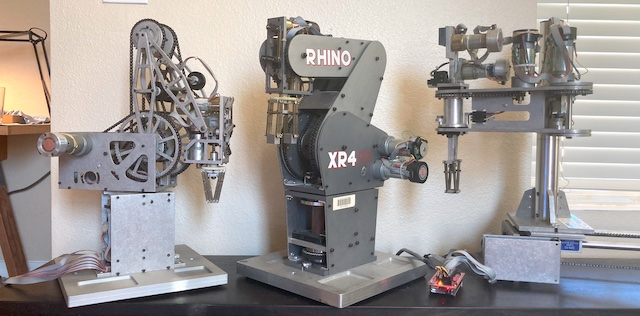

# Rhino Robots Arduino MegaMotor6 Software

Rhino_arduino_mm6 is an [Arduino 2560](https://store.arduino.cc/products/arduino-mega-2560-rev3) software package that controls Rhino Robots robotic arms and accessories via the MegaMotor6 Arduino shield.

This software is intended for hobbyists and experimenters and may be useful for learning and teaching robotics.

## Rhino Robots

Sandhu Machine Design Inc. of Champaign, Illinois produced a [series](http://www.theoldrobots.com/rhinoarm.html) of servo-controlled Rhino Robots in the 1980s. These robots were scaled down versions of their industrial counterparts (less expensive and less poweful). They were great for teaching and made their way into many instructional courses on robotics.

Today you may find them at government auctions, on eBay, or collecting dust in a closet at your local university's engineering lab.

## MegaMotor6 with Arduino 2560

The MegaMotor6 together with an [Arduino 2560](https://store.arduino.cc/products/arduino-mega-2560-rev3) and an optional power supply can be purchased from Scott Savage on [eBay](https://www.ebay.com/sch/i.html?&_nkw=MegaMotor6).  Scott builds the MegaMotor6 boards and authored of the original [GPL](LICENSE.txt)'d MegaMotor6 software this software package is based on.

The MegaMotor6 system provides a complete and modern replacement for the controller box sold with Rhino Robots decades ago.

## Installation

Follow the Arduino instructions for building and flashing this software. Once flashed, use your serial terminal to connect to the Arduino at 38,400 bps. You will see a text menu explaining the control options when connected. 

Once connected, start by running a motor test followed by a calibration. It's a good idea to stay within an arm's reach of the reset button while learning the software and how the robot moves.

Have fun!

